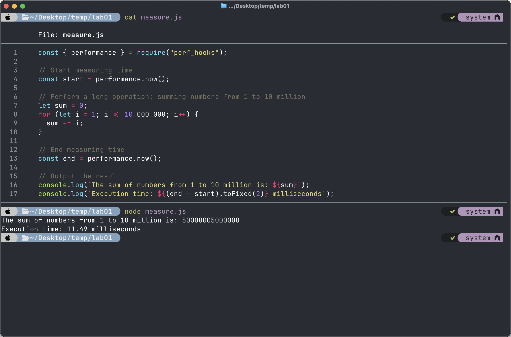
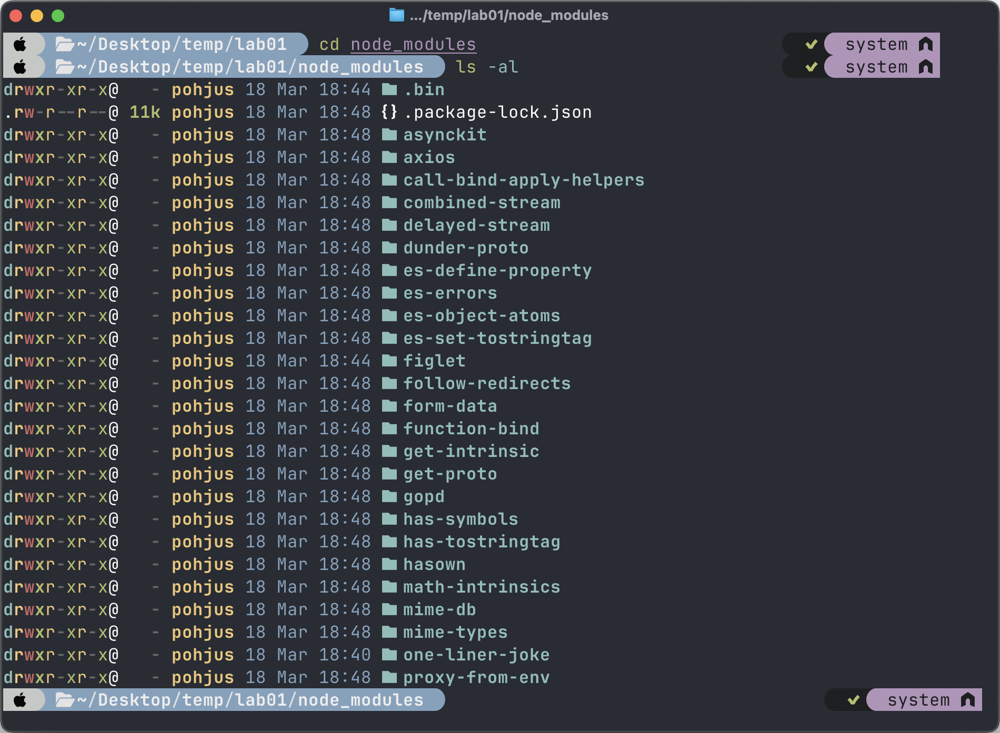

# Lab: How to Build a Proper NPM - project?

<!-- TOC tocDepth:2..3 chapterDepth:2..6 -->

- [1️⃣ Hello World](#1️⃣-hello-world)
- [2️⃣ Dependencies](#2️⃣-dependencies)
- [3️⃣ Lock file](#3️⃣-lock-file)
- [4️⃣ Improving Quality: ESLint](#4️⃣-improving-quality-eslint)
- [5️⃣ Improving Quality: Prettier](#5️⃣-improving-quality-prettier)
- [6️⃣ VS Code and Extensions](#6️⃣-vs-code-and-extensions)

<!-- /TOC -->

## 1️⃣ Hello World

Check that your `node` is installed:

    node -v

Initialize a new npm project in some project directory:

    npm init -y

This will create a `package.json` file with default values:


Now create and modify file `index.js` so that it outputs `“hello`. Then run it:

    node index.js

You can use whatever text editor or tool to create the text file. Here is macOS / Linux example of workflow:


## 2️⃣ Dependencies

Now make a file `measure.js` which content is:

```javascript
const { performance } = require("perf_hooks");

// Start measuring time
const start = performance.now();

// Perform a long operation: summing numbers from 1 to 10 million
let sum = 0;
for (let i = 1; i <= 10_000_000; i++) {
  sum += i;
}

// End measuring time
const end = performance.now();

// Output the result
console.log(`The sum of numbers from 1 to 10 million is: ${sum}`);
console.log(`Execution time: ${(end - start).toFixed(2)} milliseconds`);
```

And run it:



Notice that in here:

```javascript
const { performance } = require("perf_hooks");
```

You are using **prebuilt** [perf_hooks](https://nodejs.org/api/perf_hooks.html) module. Node will come with a lots of different modules and you can use them straight away:

| Module          | Description                                                           | Example Usage                                                              |
| --------------- | --------------------------------------------------------------------- | -------------------------------------------------------------------------- |
| `fs`            | Provides an API for interacting with the file system.                 | Reading and writing files asynchronously or synchronously.                 |
| `http`          | Used to create HTTP servers and clients.                              | Setting up a basic web server.                                             |
| `path`          | Utilities for working with file and directory paths.                  | Joining, resolving, and normalizing file paths.                            |
| `os`            | Provides operating system-related utility methods and properties.     | Fetching information about the OS, such as CPU architecture and memory.    |
| `events`        | Provides an EventEmitter class for handling asynchronous events.      | Creating custom event emitters and handling events.                        |
| `stream`        | Provides an API for stream handling.                                  | Streaming data from files or network connections.                          |
| `buffer`        | Provides a way to handle binary data.                                 | Manipulating raw binary data efficiently.                                  |
| `util`          | Provides utility functions for debugging and working with objects.    | Converting objects to strings, inspecting objects, and formatting strings. |
| `crypto`        | Provides cryptographic functionality.                                 | Creating hashes, ciphering, and deciphering data.                          |
| `child_process` | Used to spawn new processes and execute commands in the system shell. | Running shell commands from Node.js applications.                          |
| `url`           | Utilities for URL resolution and parsing.                             | Parsing and formatting URLs.                                               |
| `querystring`   | Provides methods for working with URL query strings.                  | Parsing and stringifying query strings.                                    |
| `dns`           | Used for DNS resolution.                                              | Looking up IP addresses from domain names.                                 |
| `zlib`          | Provides methods for data compression and decompression.              | Compressing and decompressing data using gzip or deflate.                  |
| `net`           | Provides an asynchronous network API.                                 | Creating TCP servers and clients.                                          |
| `tls`           | Provides TLS and SSL protocols for secure communication.              | Creating secure TCP connections.                                           |

But if you want to use third party modules, then things can get a bit compilicated. Now create file `thirdpartymodule.js` with content of:

```javascript
const oneLinerJoke = require("one-liner-joke");

// Get a random joke
const randomJoke = oneLinerJoke.getRandomJoke();

// Output the joke to the console
console.log("Here's a random joke for you:");
console.log(randomJoke.body);
```

Try to run this and you are going to get an error:


The `one-liner-joke` is third party module and it is not installed in Node.js. Now install it:

    npm install one-liner-joke

**npm** (Node Package Manager) is the default package manager for Node.js, and it is one of the most widely used package managers in the JavaScript ecosystem. It helps developers install, share, and manage packages (libraries or modules) that are used to build Node.js applications. npm is also a vast online repository of open-source JavaScript projects and libraries, known as the npm registry.

Now run your app:


It should work. Now let’s see the content of your project.

    .
    ├── index.js
    ├── measure.js
    ├── node_modules             // <--- NEW directory!
    │   └── one-liner-joke
    │       ├── LICENSE
    │       ├── README.md
    │       ├── examples
    │       │   └── example.js
    │       ├── index.js
    │       ├── jokes.json
    │       ├── package.json
    │       └── test
    │           └── test.js
    ├── package-lock.json        // <--- NEW file!
    ├── package.json             // <--- UPDATED file!
    └── thirdpartymodule.js

Now see the content of package.json:

    {
      "name": "01",
      "version": "1.0.0",
      "main": "index.js",
      "scripts": {
        "test": "echo \"Error: no test specified\" && exit 1"
      },
      "keywords": [],
      "author": "",
      "license": "ISC",
      "description": "",
      "dependencies": {
        "one-liner-joke": "^1.2.2"
      }
    }

This has been updated with:

      "dependencies": {
        "one-liner-joke": "^1.2.2"
      }

So our app is now dependent on `^1.2.2`. Notice the caret ^. This is semantic versioning.

Semantic Versioning, often abbreviated as **SemVer**, is a versioning scheme for software that aims to convey meaning about the underlying changes with each new release. It follows the format `MAJOR.MINOR.PATCH`, where each component has a specific purpose:

**Version Number Structure**

**MAJOR Version**:

- Incremented when you make incompatible API changes. This indicates that the new version **is not backward compatible with previous versions.**
- Example: Moving from 1.0.0 to 2.0.0 implies significant changes that might break existing dependencies.

**MINOR Version**:

- Incremented when you add functionality in a backward-compatible manner. **This suggests new features that don’t break existing functionality.**
- Example: Moving from 1.2.0 to 1.3.0 means new features have been added, but existing ones remain unchanged.

**PATCH Version**:

- Incremented when you make backward-compatible bug fixes. These are typically small changes meant to fix issues without altering existing functionality.
- Example: Moving from 1.2.1 to 1.2.2 indicates bug fixes have been made.

When having

    ^1.2.2

It basically means a version of `1.2.2` or higher but major version will be always the same. So we are dependent on versions for example:

    1.2.2
    1.2.3
    1.3.9

But dependency is not for

    2.0.0

This is rather important thing to understand and what possible problems can raise with this.

Now create a file `asciiart.js`. Use [figlet](https://www.npmjs.com/package/figlet) module. Create an app that looks like:


Notice that your package.json is now updated:

      "dependencies": {
        "figlet": "^1.8.0",
        "one-liner-joke": "^1.2.2"
      }

Notice also node_modules directory:


You will have two subdirectories:

1. `figlet/`
2. `one-liner-joke/`

These are your modules that have been downloaded from the cloud using npm.

Now create file `myfetch.js`. with content of:

```javascript
const axios = require("axios");

async function main() {
  let joke = await axios.get("https://api.chucknorris.io/jokes/random");
  console.log(joke.data.value);
}
main();
```

It uses [axios](https://www.npmjs.com/package/axios) module. Install that. Run your app, it should connect to the API and output some chuck norris jokes:


Now once again look at `package.json`:

      "dependencies": {
        "axios": "^1.8.3",
        "figlet": "^1.8.0",
        "one-liner-joke": "^1.2.2"
      }

Your app is dependent on three third-party modules. Now look at node_modules directory:



It contains

    axios
    figlet
    one-liner-joke

But why does it have so many other modules? See the dependencies of axios:

    cd axios
    type package.json

or in macOS/Linux

    cat package.json


Notice that it has depencies:

```json
"dependencies": {
    "follow-redirects": "^1.15.6",
    "form-data": "^4.0.0",
    "proxy-from-env": "^1.1.0"
},
```

Why does your `node_modules/` has so many modules even if you just installed three modules?

## 3️⃣ Lock file

Notice that in your project you will have also a file called `package-lock.json`.

[From stack overflow:](https://stackoverflow.com/questions/45052520/do-i-need-both-package-lock-json-and-package-json)

- `package.json`: records the minimum version you app needs. If you update the versions of a particular package, the change is not going to be reflected here.

- `package-lock.json`: records the exact version of each installed package which allows you to re-install them. Future installs will be able to build an identical dependency tree.

When pushing npm projects to github you should **ignore** the `node_modules` directory for obvious reasons:


When other developer clones or pulls your repository the other developer will not get the `node_modules` directory.

But when giving command

    npm install

This command will do **different thing depending if lock file present or not**.

If lock file is present, the developer will get **exactly the same versions of the modules to one's computer than the original developer.**

If lock file is not present, the other developer will get **updated versions of the modules.**

Now go into totally different directory and clone or download following:

    https://github.com/pohjus/restful-api-nodejs

Now try to run the application:

    node app.js

It won’t work because needed dependencies are missing:

    node:internal/modules/cjs/loader:1413
    throw err;
    ^

    Error: Cannot find module 'express'
    Require stack:
    - /Users/pohjus/Desktop/temp/lab01/node_modules/restful-api-nodejs/app.js
        at Function._resolveFilename (node:internal/modules/cjs/loader:1410:15)
        at defaultResolveImpl (node:internal/modules/cjs/loader:1061:19)
        at resolveForCJSWithHooks (node:internal/modules/cjs/loader:1066:22)
        at Function._load (node:internal/modules/cjs/loader:1215:37)
        at TracingChannel.traceSync (node:diagnostics_channel:322:14)
        at wrapModuleLoad (node:internal/modules/cjs/loader:234:24)
        at Module.require (node:internal/modules/cjs/loader:1496:12)
        at require (node:internal/modules/helpers:135:16)
        at Object.<anonymous> (/Users/pohjus/Desktop/temp/lab01/node_modules/restful-api-nodejs/app.js:3:17)
        at Module._compile (node:internal/modules/cjs/loader:1740:14) {
    code: 'MODULE_NOT_FOUND',
    requireStack: [
        '/Users/pohjus/Desktop/temp/lab01/node_modules/restful-api-nodejs/app.js'
    ]
    }

    Node.js v23.5.0

Install needed modules:

    npm install


Notice that it warns that some dependencies are deprecated.

Now you can run the app:

    node app.js


The app is running, you can close it using ctrl-c.

Now do the following

- rename `package-lock.json` to `package-lock-old.json`
- delete node_modules directory


Since `node_modules` is now missing the app won’t work. Install needed dependencies again:

    npm install

Since lock file is now missing (we changed the name) it will update all the dependencies. It uses the semantic versioning in `package.json` instead of exact versions in `package-lock.json`

Notice now that it created a new lock file that contains all the exact versions that you installed at this time.


Now try to compare these files: `package-lock-old.json` and `package-lock.json`. Can you spot any version differences?


## 4️⃣ Improving Quality: ESLint

**ESLint** is a static code analysis tool for identifying problematic patterns in JavaScript code. It's highly configurable and supports custom rules, which makes it a powerful tool for maintaining code quality and consistency across projects.

Now go back to your original project.

You can 1. install and 2. configure ESLint with following command:

    npm init @eslint/config@latest


Choose _"To check syntax, find problems"_, answer to the questions:

- ✅ How would you like to use ESLint? · problems
- ✅ What type of modules does your project use? · commonjs
- ✅ Which framework does your project use? · none
- ✅ Does your project use TypeScript? · javascript
- ✅ Where does your code run? · node

Implement now file `myeslint.js` with following code:

```javascript
if (false) {
  console.log("hello");
}
```

Now check your code through eslint:

    npx eslint myeslint.js

You should get

    /Users/chucknorris/Desktop/temp/lab01/myeslint.js
    1:5  error  Unexpected constant condition  no-constant-condition

    ✖ 1 problem (1 error, 0 warnings)

Notice that ESLint gives you an error of this code. ESLint has prebuilt rules but you can also add more. In your directory you should have a file called:

    eslint.config.mjs

This file contains configurations about your ESLint. Modify it to be:

```javascript
import globals from "globals";
import pluginJs from "@eslint/js";

/** @type {import('eslint').Linter.Config[]} */
export default [
  {
    files: ["**/*.js"],
    languageOptions: {
      sourceType: "commonjs",
      globals: globals.node, // Moved inside the same object
    },
    rules: {
      "no-var": "error", // Disallow use of var
      eqeqeq: "error", // Require strict equality (===)
      "no-unused-vars": "warn", // Warn on unused variables
      "prefer-const": "error", // Prefer const over let where possible
      "no-else-return": "error", // Disallow return before else
      curly: "error", // Enforce consistent brace style
      "no-multiple-empty-lines": ["error", { max: 1 }], // Limit multiple empty lines
      camelcase: "error", // Enforce camelCase naming
      "no-eval": "error", // Disallow eval()
    },
  },
  pluginJs.configs.recommended,
];
```

Now modify your myeslint.js and add:

```javascript
var x = 5;
if (x == 0) {
  console.log("hello");
}
```

Try to validate your code with eslint:

    npx eslint myeslint.js

You should get

    /Users/chucknorris/Desktop/temp/lab01/myeslint.js
    1:1  error  Unexpected var, use let or const instead  no-var
    2:7  error  Expected '===' and instead saw '=='       eqeqeq

    ✖ 2 problems (2 errors, 0 warnings)
    1 error and 0 warnings potentially fixable with the `--fix` option.

Now modify `eslint.config.mjs` and comment these away:

    // "no-var": "error", // Disallow use of var
    // eqeqeq: "error", // Require strict equality (===)

Now run eslint again:

    npx eslint myeslint.js

Notice that you will have less or no errors. Comment the rules back now and you will get two errors. Notice that it says:

      1 error and 0 warnings potentially fixable with the `--fix` option.

So ESlint can fix some problem you have. Try it out:

    npx eslint myeslint.js --fix

Did it fix anything? What? Answer in file comments.

## 5️⃣ Improving Quality: Prettier

ESLint is all about quality problems. But it is not about styling. For this we are using a tool called prettier, install following:

    npm install --save-dev prettier eslint-config-prettier eslint-plugin-prettier

**prettier**

- **Prettier** is an opinionated code formatter that supports many languages and integrates with most editors. It removes all original styling and ensures that all outputted code conforms to a consistent style. Using Prettier helps maintain code quality and consistency across a project, especially when working in teams.

**eslint-config-prettier**

- **eslint-config-prettier** is a configuration that disables ESLint rules that might conflict with Prettier. Since both tools have the potential to enforce or correct code formatting, this configuration ensures that ESLint does not report errors for stylistic issues that Prettier will fix. Essentially, it makes ESLint and Prettier work together harmoniously.

**eslint-plugin-prettier**

- **eslint-plugin-prettier** turns Prettier rules into ESLint rules. This plugin allows you to run Prettier as part of your ESLint configuration. When enabled, code that doesn't follow the Prettier style will fail ESLint checks, ensuring that code formatting remains consistent across the project according to Prettier's rules. This integration provides the convenience of using ESLint to both identify and fix formatting discrepancies based on Prettier's standards.

Create a `.prettierrc` file in your project root to configure Prettier options. For example

    {
      "semi": true,
    }

Update your **eslint configuration** file:

```javascript
import globals from "globals";
import pluginJs from "@eslint/js";
import prettierPlugin from "eslint-plugin-prettier";
import prettierConfig from "eslint-config-prettier";

/** @type {import('eslint').Linter.Config[]} */
export default [
  {
    files: ["**/*.js"],
    languageOptions: {
      sourceType: "commonjs",
      globals: globals.node,
    },
    plugins: {
      prettier: prettierPlugin,
    },
    rules: {
      // ESLint rules
      "no-var": "error", // Disallow use of var
      eqeqeq: "error", // Require strict equality (===)
      "no-unused-vars": "warn", // Warn on unused variables
      "prefer-const": "error", // Prefer const over let where possible
      "no-else-return": "error", // Disallow return before else
      curly: "error", // Enforce consistent brace style
      "no-multiple-empty-lines": ["error", { max: 1 }], // Limit multiple empty lines
      camelcase: "error", // Enforce camelCase naming
      "no-eval": "error", // Disallow eval()

      // Prettier rule integration
      "prettier/prettier": "error",
    },
  },
  pluginJs.configs.recommended,
  prettierConfig,
];
```

**Plugins**: We import the prettier plugin and add it to the plugins section. This allows ESLint to use Prettier as a linting rule.

**Rules**: We add "prettier/prettier": "error" to our rules. This ensures that any code formatting issues identified by Prettier will be reported as ESLint errors.

**Prettier Configuration**: The prettierConfig import disables all ESLint rules that might conflict with Prettier by extending eslint-config-prettier. This configuration is applied after other configurations to ensure no conflict between ESLint rules and Prettier formatting.

**Module Import and Use**: We use the import syntax to bring in both plugins and configurations, reflecting the modern ESM-based setup in .mjs files.

Now the situation is that when running ESLint command it will check both quality and code styling using prettier. So only one command to do both!

Now change your code to be:

```javascript
var x = 5;
if (x == 0) {
  console.log("hello");
}
```

Try out again:

    npx eslint myeslint.js

You should see

    /Users/chucknorris/Desktop/temp/lab01/myeslint.js
    1:1   error  Unexpected var, use let or const instead                             no-var
    1:10  error  Insert `;`                                                           prettier/prettier
    2:7   error  Expected '===' and instead saw '=='                                  eqeqeq
    2:13  error  Delete `⏎`                                                           prettier/prettier
    4:1   error  Replace `······console.log("hello")` with `··console.log("hello");`  prettier/prettier

    ✖ 5 problems (5 errors, 0 warnings)
    4 errors and 0 warnings potentially fixable with the `--fix` option.

Notice now that ESLint and prettier are linked. ESLint trigger Prettier.

Try out the fix option:

    npx eslint myeslint.js --fix


Notice that it fixed styling issues and quality issues. One error `==` => `===` was not fixable, so this a thing that has to be done manually:


## 6️⃣ VS Code and Extensions

Now install ESLint and Prettier extensions to VSCode.

Open your project **directory** in VS Code and notice that all ESLint (and prettier) problems are now displayed graphically:


Modify also VS Code settings that when saving a file it will trigger:

    npx eslint CURRENTFILE.js --fix

command. To do that open settings and it’s raw `settings.json` file:

Add / modify following:

      "editor.codeActionsOnSave": {
        "source.fixAll.eslint": "explicit"
      },
      "eslint.validate": [
        "javascript",
        "javascriptreact",
        "typescript",
        "typescriptreact"
      ],
      "eslint.run": "onType",
      "eslint.format.enable": true,
      "editor.formatOnPaste": true,
      "editor.formatOnSave": true,


Now on save notice that it fixes styling and quality problems:


You now have a proper NPM project with ESLint, Prettier and VS Code as editor! 🎉
