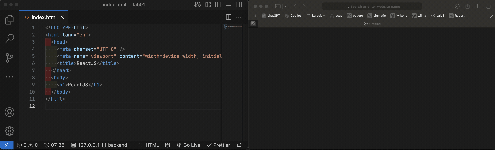
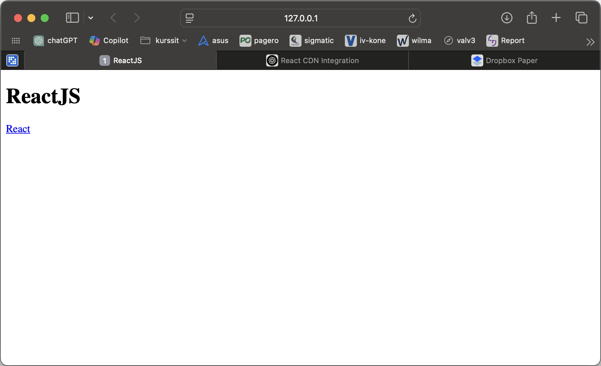
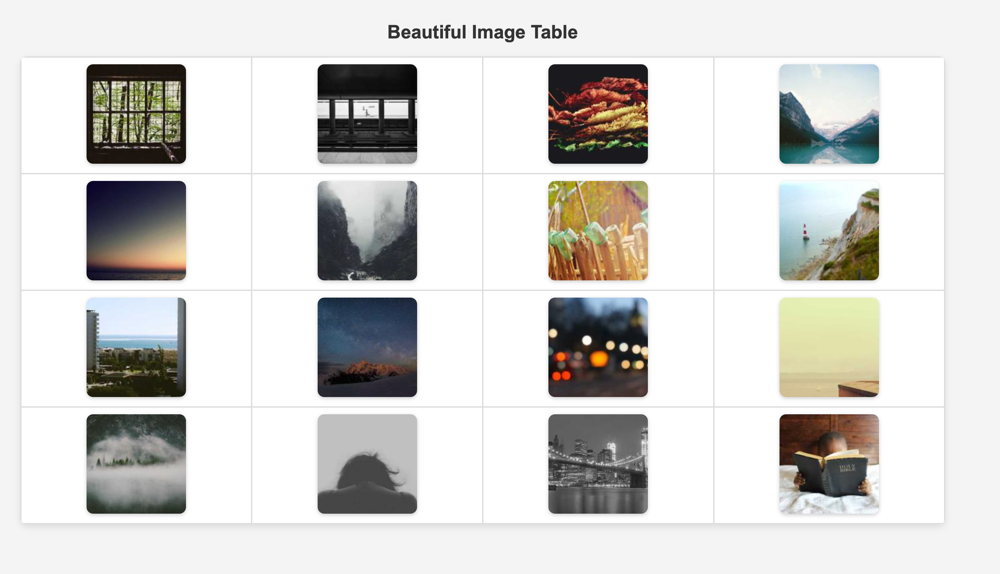

# ⚛️ Lab: ReactJS Hello World

<!-- TOC tocDepth:2..3 chapterDepth:2..6 -->

- [1️⃣ Hello World](#1️⃣-hello-world)
- [2️⃣ Babel](#2️⃣-babel)
- [3️⃣ Functional Components with Copy and Paste style](#3️⃣-functional-components-with-copy-and-paste-style)
- [4️⃣ Functional Components and an Array](#4️⃣-functional-components-and-an-array)
- [5️⃣ Several Functional Components](#5️⃣-several-functional-components)
- [6️⃣ Using Fetch API](#6️⃣-using-fetch-api)
- [7️⃣ Building a Profile Card with Props](#7️⃣-building-a-profile-card-with-props)

<!-- /TOC -->

## 1️⃣ Hello World

**Tools**

- [Visual Studio Code](https://code.visualstudio.com/)
- [Node.js](https://nodejs.org/)
- (Optional) [Live Server extension for VS Code](https://marketplace.visualstudio.com/items?itemName=ritwickdey.LiveServer)

**Step 1**

- Create file called `index.html` with VS Code
- Open that file in browser. Every change you make to the code, you will have to refresh the browser.
- Optional: Use live server extension in VS Code. If using this approach, open the **directory** where `index.html` is. Start the server (go live button on bottom of vs code) Refresh happens automatically.

Content of `index.html`

```html
<!DOCTYPE html>
<html lang="en">
  <head>
    <meta charset="UTF-8" />
    <meta name="viewport" content="width=device-width, initial-scale=1.0" />
    <title>ReactJS</title>
  </head>
  <body>
    <h1>ReactJS</h1>
  </body>
</html>
```

If using Live Server, your workflow could look like:



Now add couple of scripts inside of `<head>..</head>` element:

```html
<script src="https://unpkg.com/react@18/umd/react.production.min.js"></script>
<script src="https://unpkg.com/react-dom@18/umd/react-dom.production.min.js"></script>
```

These two `<script>` tags include React and ReactDOM from a CDN (Content Delivery Network) for use in a web page without a build step.

The first one is:

- This script loads the React library.
- React provides the core API for defining components and managing state.
- The URL points to version 18 of React, delivered via UNPKG, a popular CDN for npm packages.
- `"umd/react.production.min.js"` indicates the UMD (Universal Module Definition) build, which works in both browsers and Node.js.
- `"production.min.js"` is the minified production build, optimized for performance.

And second one:

- This script loads ReactDOM, which provides methods for rendering React components into the DOM.
- It’s necessary when using React with a web browser, as it bridges React components with the actual HTML document.
- Like the previous script, it's from UNPKG, uses the UMD build, and is minified for production.

Then inside of `<body>...</body>` add `<div id="root"></div>` and

```html
<script>
  // Get reference to the div
  const myDiv = document.getElementById("root");

  // Create link
  const link = React.createElement(
    "a",
    { href: "https://reactjs.org/" },
    "React"
  );

  // Get the root element of our app
  const root = ReactDOM.createRoot(myDiv);

  // Inject the link inside of root (div)
  root.render(link);
</script>
```

And you should see:



## 2️⃣ Babel

**Using JSX with Babel in a Browser Setup**

React normally uses **JSX** (a syntax extension that looks like HTML) to define components, but browsers don’t understand JSX directly. To use JSX in this browser-based setup, you need **Babel** to transpile JSX into regular JavaScript.

With Babel you can use new EcmaScript standard and Babel will compile it to older EcmaScript for browsers that do not support new ES. Also Babel understands JSX which is an extension to JavaScript language. So when adding Babel to your project, you can freely use new ES and JSX and you don’t have to worry about compatibility with browsers.

**Steps to Include JSX:**

1. Add **Babel** via a CDN.
2. Use `<script type="text/babel">` for JSX code.

**Example: JSX with Babel**

```html
<!DOCTYPE html>
<html lang="en">
  <head>
    <meta charset="UTF-8" />
    <meta name="viewport" content="width=device-width, initial-scale=1.0" />
    <title>React with JSX in the Browser</title>
    <script src="https://unpkg.com/react@18/umd/react.production.min.js"></script>
    <script src="https://unpkg.com/react-dom@18/umd/react-dom.production.min.js"></script>
    <script src="https://unpkg.com/@babel/standalone/babel.min.js"></script>
  </head>
  <body>
    <div id="root"></div>

    <script type="text/babel">
      function App() {
        return <h1>Hello, JSX in React!</h1>;
      }

      const root = ReactDOM.createRoot(document.getElementById("root"));
      root.render(<App />);
    </script>
  </body>
</html>
```

**Explanation:**

- **Babel (`@babel/standalone`)**: This library compiles JSX into JavaScript that browsers can understand.
- **`<script type="text/babel">`**: Ensures Babel processes the script, allowing JSX syntax.
- **React component (`App`)**: Uses JSX to return `<h1>Hello, JSX in React!</h1>`.
- **Rendering**: `ReactDOM.createRoot().render(<App />)` mounts the component to the DOM.

**When to Use This Setup?**

- ✅ **Good for quick demos or testing small React components.**
- ❌ **Not recommended for production**—it loads Babel in the browser, which slows performance.

Now modify your file so that you will change the link implementation to JSX.

## 3️⃣ Functional Components with Copy and Paste style

A component let’s you split the UI into reusable pieces. The component can be

- Function component
- Class component

In the older versions of React you differentiate these two by features they had:

So notice that class component have additional features to function component. But in the latest version of React, by using react hooks, the situation is:

It seems that the future of React development is in function components, even though class components are not deprecated.

To declare a function component, write a ECMAScript function that

- Usually accepts object argument (props)
- Returns a React element
- Is written with capital letter

Example:

```javascript
// function component
function Link(properties) {
  return <a href={properties.link}>{properties.text}</a>;
}

ReactDOM.render(
  <Link link="http://www.google.com" text="google" />,
  document.getElementById("root")
);
```

If you use more modern approach with arrow syntax

```javascript
const Link = (properties) => <a href={properties.link}>{properties.text}</a>;
```

Try it out. This should just create a link. Notice that when using

```javascript
<Link link="http://www.google.com" text="google" />
```

This will call the Link - function with an argument object:

```javascript
{ "link": "http://www.google.com", "text": "google" }
```

Try this also:

```javascript
const Link = (properties) => {
  console.log(properties); // outputting
  return <a href={properties.link}>{properties.text}</a>;
};
```

It is possible that components refer to other components:

```javascript
const Link = (properties) => <a href={properties.link}>{properties.text}</a>;

const CloudResources = () => {
  return (
    <ul>
      <li>
        <Link link="https://aws.amazon.com" text="Amazon Web Services (AWS)" />
      </li>
      <li>
        <Link
          link="https://cloud.google.com"
          text="Google Cloud Platform (GCP)"
        />
      </li>
      <li>
        <Link link="https://azure.microsoft.com" text="Microsoft Azure" />
      </li>
    </ul>
  );
};

const root = ReactDOM.createRoot(document.getElementById("root"));
root.render(<T3 />);
```

Try it out.

Typically React apps have a single App component at the very top.

By using JSX you can embed also arrays:

```javascript
function App() {
  const hello = <li>Hello World</li>;
  return <ul>{[hello, hello, hello, hello]}</ul>;
}

const root = ReactDOM.createRoot(document.getElementById("root"));
root.render(<App />);
```

Try it out.

## 4️⃣ Functional Components and an Array

Now create function component:

```javascript
const root = ReactDOM.createRoot(document.getElementById("root"));
root.render(<List amount={4} txt="Buy Milk" />);
```

Which will create <ul><li> list with given items (amount and text). If amount is 4 and txt is “buy milk” it will generate:

```html
<ul>
  <li>Buy Milk</li>
  <li>Buy Milk</li>
  <li>Buy Milk</li>
  <li>Buy Milk</li>
</ul>
```

Modify this also that you can influence if this is ordered:

```javascript
<List amount={4} ordered={true} txt="Buy Milk" />
```

If ordered is true, then:

```html
<ol>
  <li>Buy Milk</li>
  <li>Buy Milk</li>
  <li>Buy Milk</li>
  <li>Buy Milk</li>
</ol>
```

Otherwise use `ul` instead of `ol`

Use [object destruct](https://developer.mozilla.org/en-US/docs/Web/JavaScript/Reference/Operators/Destructuring) and [ternary operator](https://developer.mozilla.org/en-US/docs/Web/JavaScript/Reference/Operators/Conditional_operator) in your solution.

## 5️⃣ Several Functional Components

Now create React components that help you to build an app with an html table full of random images. The entry point of the app looks like:

```javascript
root.render(<Table rows={4} cols={4} />);
```

Create

- `Table` function component
- `Row` function component
- `RandomImage` function component

The `Table` uses the `Row` and the `Row` uses the `RandomImage`. In the end you should have a table 4 x 4 with random images if given 4 x 4. You can change the rows and cols amount by changing the attributes:

```html
<table rows="{X}" cols="{Y}" />
```

App could look like:



---

**Optional: Tips about Array Creation**

You can create an array full of JSX and it will be "flatted" on the UI:

```javascript
const MyComponent = () => {
  let arr = [];
  for (let i = 0; i < 5; i++) {
    arr.push(<li>Hello</li>);
  }
  return <ul>{arr}</ul>;
};
```

This will generate

```html
<ul>
  <li>Hello</li>
  <li>Hello</li>
  <li>Hello</li>
  <li>Hello</li>
  <li>Hello</li>
</ul>
```

You can also create array with fixed size:

```javascript
let arr = Array.from({ length: 5 });
```

And now you will have array of size 5 and all elements are `undefined`:

```javascript
let arr = [undefined, undefined, undefined, undefined, undefined];
```

By using _functional approach_, you can modify and make a new version of the array using `map` - function:

```javascript
// index is 0, 1, 2, 3
// value will be the element value for each index, in this
// case it will be undefined

function modify(value, index) {
    return <li>{index}<li> // this will be the new value
}

let newArr = arr.map(modify)
```

And now the `newArr` is:

```javascript
let newArr = [
  <li>0</li>,
  <li>1</li>,
  <li>2</li>,
  <li>3</li>,
  <li>4</li>,
  <li>5</li>,
];
```

And when doing:

```javascript
const MyComponent = () => {
    let arr = Array.from({ length: 5 })
    function modify(value, index) {
        return <li>Hello<li> // this will be the new value
    }

    let newArr = arr.map(mody)
    return <ul>{arr}</ul>;
 };
```

Should modify the array to contain `5` x `<li>Hello</li>`

We can do this implementation with arrow functions a lot less code:

```javascript
const MyComponent = () => {
  let arr = Array.from({ length: 5 });
  let newArr = arr.map((value, index) => <li>Hello</li>);
  return <ul>{arr}</ul>;
};
```

And we do not need `newArr` variable:

```javascript
const MyComponent = () => {
  let arr = Array.from({ length: 5 }).map((value, index) => <li>Hello</li>);
  return <ul>{arr}</ul>;
};
```

And we do not need `arr` - variable:

```javascript
const MyComponent = () => {
  return (
    <ul>
      {Array.from({ length: 5 }).map((value, index) => (
        <li>Hello</li>
      ))}
    </ul>
  );
};
```

Since we do not need `value` - variable:

```javascript
const MyComponent = () => {
  return (
    <ul>
      {Array.from({ length: 5 }).map((_, index) => (
        <li>Hello</li>
      ))}
    </ul>
  );
};
```

And in React if you have sister elements, like `<li>` which is create dynamically, these elements should have a key for helping React in performance.

```javascript
const MyComponent = () => {
  return (
    <ul>
      {Array.from({ length: 5 }).map((_, index) => (
        <li key={index}>Hello</li>
      ))}
    </ul>
  );
};
```

## 6️⃣ Using Fetch API

Create function component `<FetchIt url="https://…">`. UI will have one button:

```html
<button onClick="{fetchIt}">Refresh</button>
```

Implement the fetchIt function which will fetch the content of given url. Output the json to console when button is clicked. If fetch fails, give proper error messages to console.

Implement this so that you can choose the library:

```html
// Uses fetch API
<FetchIt url="https://jsonplaceholder.typicode.com/posts/1" library="fetch" />
// Uses axios
<FetchIt url="https://jsonplaceholder.typicode.com/posts/1" library="axios" />
// Uses jquery
<FetchIt url="https://jsonplaceholder.typicode.com/posts/1" library="jquery" />
```

## 7️⃣ Building a Profile Card with Props

Build a simple "Profile Card" application that includes the following components:

- `App`: The main component.
- `ProfileCard`: A functional component that displays user information (name, bio, and profile picture).
- `ProfileList`: A functional component that renders multiple `ProfileCard` components based on a list of user data.

Component Details

App Component

- This will use the `ProfileList` component.
- Pass a list of user objects as props to `ProfileList`.

ProfileList Component

- Accept a `users` prop (array of user objects).
- Iterate over the array and render a `ProfileCard` for each user.

ProfileCard Component

- Accept `name`, `bio`, and `profilePic` as props.
- Display a user’s profile picture, name, and bio using JSX.

Sample User Data
Use the following data in the `App` component:

```javascript
const users = [
{ id: 1, name: "John Doe", bio: "Software developer from New York", profilePic: "https://via.placeholder.com/150" },
{ id: 2, name: "Jane Smith", bio: "Graphic designer and artist", profilePic: "https://via.placeholder.com/150" },
{ id: 3, name: "Mike Johnson", bio: "Digital nomad and blogger", profilePic: "https://via.placeholder.com/150" },
```

Example output:

    ------------------------
    | [Profile Picture]    |
    | Name: John Doe       |
    | Bio: Software dev... |
    ------------------------
