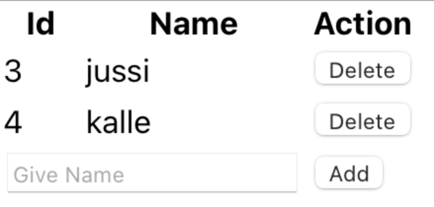
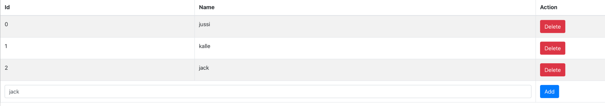

# ⚛️ Lab: React Hooks

---

<!-- TOC tocDepth:2..3 chapterDepth:2..6 -->

- [1️⃣ Creating Project using VITE or CRA](#1️⃣-creating-project-using-vite-or-cra)
- [2️⃣ State using React Hooks](#2️⃣-state-using-react-hooks)
- [3️⃣ User Input and Simple Calculator](#3️⃣-user-input-and-simple-calculator)
- [4️⃣ Lists and keys](#4️⃣-lists-and-keys)
  - [a) Array to JSX and keys](#a-array-to-jsx-and-keys)
  - [b) Event Handling: Button](#b-event-handling-button)
  - [c) Event Handling: input](#c-event-handling-input)
  - [d) Event Handling: Delete](#d-event-handling-delete)
  - [e) Sort](#e-sort)
  - [f) Bootstrap](#f-bootstrap)

<!-- /TOC -->

---

<!--
## 1️⃣ Creating Project using VITE or CRA

You may choose your tool

- Vite
- CRA (create-react-app)
- Or other.. (Next.js etc)

Let’s now use more professional approach for our app development. Create new project using

CRA:

    npx create-react-app calculator
    cd calculator
    npm start

Vite:

    npm create vite@latest calculator
    cd calculator
    npm install

Choose: React, JavaScript + SWC

    │
    ◇  Select a framework:
    │  React
    │
    ◇  Select a variant:
    │  JavaScript + SWC
    │
    ◇  Scaffolding project in /Users/pohjus/Documents/react-course/assignment-react-hooks/calculator...
    │
    └  Done. Now run:

    cd calculator
    npm install
    npm run dev

It should create new directory called `calculator`. Open the whole directory in Visual Studio Code.

In terminal, move to inside of this directory (`cd calculator`). Give command `npm start` (CRA) or `npm run dev` (Vite):

> Running Vite:


In CRA open `public/index.html`. Can you find:

    <div id="root"></div>

In Vite open `index.html` that is in the root.

In here React will inject your custom components.

Now open `index.js` or `main.jsx`. This is the starting point of your app. Can you find:

    createRoot(document.getElementById('root')).render(
        <StrictMode>
            <App />
        </StrictMode>,
    )

It will inject the `<App/>` component inside of the `div`. Strict mode here enables additional warnings.

Now open `src/App.jsx`. In here you can find your component, modify it so that it just outputs “Hello World”:

```javascript
function App() {
  return <h1>Hello World</h1>;
}
```

See that the browser should refresh itself!

Now create new component which can be used like:

```html
<Greeting />
```

This will just display `<p>hello world</p>`.

Save this component in a different file and folder: `components/Greeting.jsx`. Export the component. Import it in App.js and use it from there.

## 2️⃣ State using React Hooks

In the previous versions of React, only way to get a state was to use class components. Current versions support state and lifecycle also in function components.

Let’s first see where we need the concept of state.

Create new function component:

```javascript
function Calculate() {
  return <p>Hello</p>;
}
```

Modify the UI to be:

```html
<button onClick="{click}">Calculate</button>
<p>Result = {result}</p>
```

And define the `result` variable inside of your function:

    let result = 5;

You should see something like a button and a text `Result = 5` in your UI.

Now add your click function inside of App (if not already):

```javascript
function Calculate() {
  let result = 5;

  // ES6 style function, you can also use traditional approach
  const click = () => {
    alert("hello world");
  };

  return (
    <div>
      <button onClick={click}>Calculate</button>
      <p>Result = {result}</p>
    </div>
  );
}
```

Now when clicking the button, modify the `result` - variable. Does the UI change? Do you see the new result in the UI? It should not work. If we want to update the UI we need the concept of state. When state changes, then UI refreshes.

To create a state to our components, let’s use React’s `useState` function. In your App function:

```javascript
let myarray = React.useState(5);
```

You will have to import React - object:

    import React from "react";

Well what is happening here?

```javascript
let myarray = React.useState(5);
```

You define the default state (number 5) in your component. It returns

- default state back
- function which you can use to change the state

You may wonder that it returns just one thing, but notice that the return value is an array! And because it is an array you can do:

```javascript
let myarray = React.useState(5);
let result = myarray[0];
let setResult = myarray[1];
```

The `result` here contains the default state which is `5`. The `setResult` is an function that you use to change the state. And when you change the state using this function UI refreshes!

Now modify your click:

```javascript
const click = () => {
  // change the result variable AND refresh the UI
  setResult(Math.random());
};
```

And in the UI:

    <p>Result = {result}</p>

Try it out. Your app should display random number when clicking.

By using array destruct, create the state, result and setResult variables with one line.

## 3️⃣ User Input and Simple Calculator

Now remove the button.

Modify your app so that it receives the input from user:

    <input type="number" name="number1" onChange={function-here} />

Ask two numbers and output the sum of these immediately when user gives input.

## 4️⃣ Lists and keys

Create a new project or just create new component for this exercise.

### a) Array to JSX and keys

If you are displaying sibling html - elements dynamically, for example:

```html
<ul>
  <li>james</li>
  <li>paul</li>
</ul>
```

.. then you should use keys. The main purpose of keys is to help React differentiate and distinguish elements from each other, increasing its performance. So you should have:

```html
<ul>
  <li key="0">james</li>
  <li key="1">paul</li>
</ul>
```

Key can be whatever, as long as it’s unique. Now create component that will display customer names in a ul li list. The customers are stored in array:

```json
[{ "name": "james" }, { "name": "paul" }]
```

Add this array as a state to your component.

```javascript
let [customers, setCustomers] = useState(...)
```

Display the customers array in UI like:

```html
<ul>
  <li>james</li>
  <li>paul</li>
</ul>
```

So you could return

```javascript
return <ul>{listItems}</ul>;
```

The listItems is an array containing JSX:

```javascript
[<li>james</li>, <li>paul</li>];
```

To transform an array

```json
[{ "name": "james" }, { "name": "paul" }]
```

To JSX array:

```javascript
[<li>james</li>, <li>paul</li>];
```

Use `map`- function. Can you display this new array in UI as an ul li list?

See console for warnings, it should warn you about the keys. Add key to each li item and use array index (although this is not a recommendation\*). The warning should disappear.

You can also modify your data to be

```json
[
  { "id": 1, "name": "james" },
  { "id": 2, "name": "paul" }
]
```

You can try to auto generate the id.

### b) Event Handling: Button

Add a button Add to your UI:

```html
<button onClick="{clicked}">add</button>
```

Create the clicked function:

```javascript
function clicked(event) {}
```

When clicking the button a new customer should appear in the UI. You can use whatever name and id. So:

```javascript
setCustomer(...)
```

Create new array which contains the stuff from the old customers array, add a new object and pass this new array to set method. New customer should be visible when add is clicked.

### c) Event Handling: input

Implement the UI so that user can give the name. Add new state:

```javascript
let [name, setName] = useState();
```

Use this state in input:

```javascript
<input
  type="text"
  placeholder="name"
  onChange={(event) => setName(event.target.value)}
/>
```

And then use the name in clicked function.

### d) Event Handling: Delete

Implement the possibility to delete a customer. Your UI could look like in the end:



Use HTML Tables.

### e) Sort

Implement the table so that when clicking the title “name” or title “id” it will sort it according to the title. Click will toggle the sort order from ascending to descending.

### f) Bootstrap

Get to know Table - component in React Bootstrap. Install the component library and use the Table component in your solution so that UI looks polished. Try out other components.

Installation:

https://react-bootstrap.netlify.app/docs/getting-started/introduction


-->
