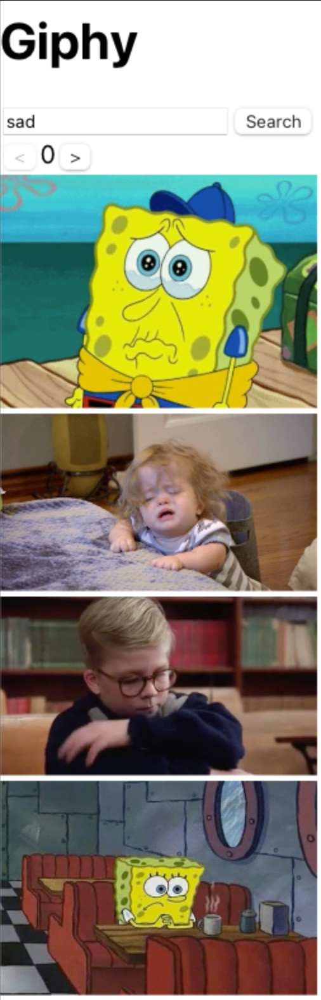

# ⚛️ Lab: React Hooks

---

<!-- TOC tocDepth:2..3 chapterDepth:2..6 -->

- [1️⃣ Creating Project using VITE or CRA](#1️⃣-creating-project-using-vite-or-cra)
- [2️⃣ State using React Hooks](#2️⃣-state-using-react-hooks)
- [3️⃣ User Input and Simple Calculator](#3️⃣-user-input-and-simple-calculator)
- [4️⃣ Lists and keys](#4️⃣-lists-and-keys)
  - [a) Array to JSX and keys](#a-array-to-jsx-and-keys)
  - [b) Event Handling: Button](#b-event-handling-button)
  - [c) Event Handling: input](#c-event-handling-input)
  - [d) Event Handling: Delete](#d-event-handling-delete)
  - [e) Sort](#e-sort)
  - [f) Bootstrap](#f-bootstrap)
- [5️⃣ UseEffect](#5️⃣-useeffect)
- [6️⃣ Using Props and Lifecycle](#6️⃣-using-props-and-lifecycle)
- [7️⃣ Lifting State Up](#7️⃣-lifting-state-up)
  - [a) Passing a function as props](#a-passing-a-function-as-props)
  - [b) Passing variable from child to parent](#b-passing-variable-from-child-to-parent)
  - [c) Passing variable to sibling](#c-passing-variable-to-sibling)
  - [d) User given variable](#d-user-given-variable)
- [8️⃣ Giphy](#8️⃣-giphy)

<!-- /TOC -->

---

## 1️⃣ Creating Project using VITE or CRA

You may choose your tool

- Vite
- CRA (create-react-app)
- Or other.. (Next.js etc)

Let’s now use more professional approach for our app development. Create new project using

CRA:

    npx create-react-app calculator
    cd calculator
    npm start

Vite:

    npm create vite@latest calculator
    cd calculator
    npm install

Choose: React, JavaScript + SWC

    │
    ◇  Select a framework:
    │  React
    │
    ◇  Select a variant:
    │  JavaScript + SWC
    │
    ◇  Scaffolding project in /Users/pohjus/Documents/react-course/assignment-react-hooks/calculator...
    │
    └  Done. Now run:

    cd calculator
    npm install
    npm run dev

It should create new directory called `calculator`. Open the whole directory in Visual Studio Code.

In terminal, move to inside of this directory (`cd calculator`). Give command `npm start` (CRA) or `npm run dev` (Vite):

> Running Vite:


In CRA open `public/index.html`. Can you find:

    <div id="root"></div>

In Vite open `index.html` that is in the root.

In here React will inject your custom components.

Now open `index.js` or `main.jsx`. This is the starting point of your app. Can you find:

    createRoot(document.getElementById('root')).render(
        <StrictMode>
            <App />
        </StrictMode>,
    )

It will inject the `<App/>` component inside of the `div`. Strict mode here enables additional warnings.

Now open `src/App.jsx`. In here you can find your component, modify it so that it just outputs “Hello World”:

```javascript
function App() {
  return <h1>Hello World</h1>;
}
```

See that the browser should refresh itself!

Now create new component which can be used like:

```html
<Greeting />
```

This will just display `<p>hello world</p>`.

Save this component in a different file and folder: `components/Greeting.jsx`. Export the component. Import it in App.js and use it from there.

## 2️⃣ State using React Hooks

In the previous versions of React, only way to get a state was to use class components. Current versions support state and lifecycle also in function components.

Let’s first see where we need the concept of state.

Create new function component:

```javascript
function Calculate() {
  return <p>Hello</p>;
}
```

Modify the UI to be:

```html
<button onClick="{click}">Calculate</button>
<p>Result = {result}</p>
```

And define the `result` variable inside of your function:

    let result = 5;

You should see something like a button and a text `Result = 5` in your UI.

Now add your click function inside of App (if not already):

```javascript
function Calculate() {
  let result = 5;

  // ES6 style function, you can also use traditional approach
  const click = () => {
    alert("hello world");
  };

  return (
    <div>
      <button onClick={click}>Calculate</button>
      <p>Result = {result}</p>
    </div>
  );
}
```

Now when clicking the button, modify the `result` - variable. Does the UI change? Do you see the new result in the UI? It should not work. If we want to update the UI we need the concept of state. When state changes, then UI refreshes.

To create a state to our components, let’s use React’s `useState` function. In your App function:

```javascript
let myarray = React.useState(5);
```

You will have to import React - object:

    import React from "react";

Well what is happening here?

```javascript
let myarray = React.useState(5);
```

You define the default state (number 5) in your component. It returns

- default state back
- function which you can use to change the state

You may wonder that it returns just one thing, but notice that the return value is an array! And because it is an array you can do:

```javascript
let myarray = React.useState(5);
let result = myarray[0];
let setResult = myarray[1];
```

The `result` here contains the default state which is `5`. The `setResult` is an function that you use to change the state. And when you change the state using this function UI refreshes!

Now modify your click:

```javascript
const click = () => {
  // change the result variable AND refresh the UI
  setResult(Math.random());
};
```

And in the UI:

    <p>Result = {result}</p>

Try it out. Your app should display random number when clicking.

By using array destruct, create the state, result and setResult variables with one line.

## 3️⃣ User Input and Simple Calculator

Now remove the button.

Modify your app so that it receives the input from user:

    <input type="number" name="number1" onChange={function-here} />

Ask two numbers and output the sum of these immediately when user gives input.

## 4️⃣ Lists and keys

Create a new project or just create new component for this exercise.

### a) Array to JSX and keys

If you are displaying sibling html - elements dynamically, for example:

```html
<ul>
  <li>james</li>
  <li>paul</li>
</ul>
```

.. then you should use keys. The main purpose of keys is to help React differentiate and distinguish elements from each other, increasing its performance. So you should have:

```html
<ul>
  <li key="0">james</li>
  <li key="1">paul</li>
</ul>
```

Key can be whatever, as long as it’s unique. Now create component that will display customer names in a ul li list. The customers are stored in array:

```json
[{ "name": "james" }, { "name": "paul" }]
```

Add this array as a state to your component.

```javascript
let [customers, setCustomers] = useState(...)
```

Display the customers array in UI like:

```html
<ul>
  <li>james</li>
  <li>paul</li>
</ul>
```

So you could return

```javascript
return <ul>{listItems}</ul>;
```

The listItems is an array containing JSX:

```javascript
[<li>james</li>, <li>paul</li>];
```

To transform an array

```json
[{ "name": "james" }, { "name": "paul" }]
```

To JSX array:

```javascript
[<li>james</li>, <li>paul</li>];
```

Use `map`- function. Can you display this new array in UI as an ul li list?

See console for warnings, it should warn you about the keys. Add key to each li item and use array index (although this is not a recommendation\*). The warning should disappear.

You can also modify your data to be

```json
[
  { "id": 1, "name": "james" },
  { "id": 2, "name": "paul" }
]
```

You can try to auto generate the id.

### b) Event Handling: Button

Add a button Add to your UI:

```html
<button onClick="{clicked}">add</button>
```

Create the clicked function:

```javascript
function clicked(event) {}
```

When clicking the button a new customer should appear in the UI. You can use whatever name and id. So:

```javascript
setCustomer(...)
```

Create new array which contains the stuff from the old customers array, add a new object and pass this new array to set method. New customer should be visible when add is clicked.

### c) Event Handling: input

Implement the UI so that user can give the name. Add new state:

```javascript
let [name, setName] = useState();
```

Use this state in input:

```javascript
<input
  type="text"
  placeholder="name"
  onChange={(event) => setName(event.target.value)}
/>
```

And then use the name in clicked function.

### d) Event Handling: Delete

Implement the possibility to delete a customer. Your UI could look like in the end:


Use HTML Tables.

### e) Sort

Implement the table so that when clicking the title “name” or title “id” it will sort it according to the title. Click will toggle the sort order from ascending to descending.

### f) Bootstrap

Get to know Table - component in React Bootstrap. Install the component library and use the Table component in your solution so that UI looks polished. Try out other components.

Installation:

https://react-bootstrap.netlify.app/docs/getting-started/introduction


## 5️⃣ UseEffect

Create new file: `components/Person.js`:

```javascript
function Person() {
  return <p>Not loaded yet</p>;
}
```

And use this in App.js:

```javascript
return (
  <>
    <h1>StarWars API</h1>
    <Person />
  </>
);
```

Now let’s connect to star wars api and fetch luke skywalker’s name.

In addition to state, you can create lifecycle using react hooks. Idea is that when component is mounted to DOM, it will start fetching data automatically.

To do this, try out `React.useEffect`:

```javascript
React.useEffect(() => {
  // Stuff that happens when component is mounted (or updated!)
  console.log("loaded");
});
```

See that you will get the string to console.

Now let’s use a state. Add:

```javascript
let [random, setRandom] = React.useState(0);
```

And in your UI (modify)

```javascript
return <p>{random}</p>;
```

And when component is loaded:

```javascript
React.useEffect(() => {
  setRandom(Math.random());
});
```

What happens? Notice that this useEffect arrow function is called

- a) when component is mounted
- b) when component is updated (state changes)

Because now state changes in here, it will invoke the arrow function again! Which will invoke the arrow function again … and again …

The React.useEffect has two arguments

- a) function
- b) dependency list (array)

If you pass empty array (how intuitive 🙂 ) the function is run only one time when component is mounted:

```javascript
React.useEffect(() => {
  setRandom(Math.random());
}, []);
```

Let’s see some more uses with dependencies later on.

Let’s now do some fetching from start wars api, use url `https://swapi.dev/api/people/1/`. And display the contents of this to console first.

Modify your app so that it displays Luke Skywalker’s name in the end in the UI.

Remember that you cannot use async function in useEffect. If you want to implement async/await:

```javascript
React.useEffect(() => {
  async function fetchIt() {
    // in here you can use await
  }
  fetchIt();
}, []);
```

## 6️⃣ Using Props and Lifecycle

Now change your main component, App, so you can pass the id:

```javascript
function App() {
  return <Person id={1} />;
}
```

And when changing this it will display different name in the UI:

```javascript
React.useEffect(() => {
  fetch(`https://swapi.dev/api/people/${props.id}/`);
}, []);
```

Notice that your app may get an error now:

> React Hook React.useEffect has a missing dependency: 'props.id'. Either include it or remove the dependency array react-hooks/exhaustive-deps

So it suggest you to either

- a) Remove the empty array [] from dependency list (eternal loop!!)

Or

- b) Add new dependency, props.id.

Let’s do b:

```javascript
React.useEffect(() => {
  fetch(`https://swapi.dev/api/people/${props.id}/`);
}, [props.id]);
```

Now the `useEffect` is called when `props.id` changes!

Well it does not change in our app at all. Let’s make a modification to this, implement your app so that user can give the id:


So in your main component, ask the id, pass it as props to the component you have now created.

Main component could look like

```javascript
function App() {
  let [id, setId] = useState(1);
  return (
    <div>
      <h1>App</h1>
      <input type="number" onChange={(e) => setId(Number(e.target.value))} />
      <Person id={id} />
    </div>
  );
}
```

When changing the id, the props changes and when props changes the use effect takes place. So it “depends on that value and when it changes it invokes the function”.

If time, try to create also error handling so that if input is empty it does not fetch anything.

## 7️⃣ Lifting State Up

How do sister elements share date between them? Let’s use lifting state up.

### a) Passing a function as props

Take the following

```javascript
function App() {
  return (
    <div>
      <Input />
      <Output />
    </div>
  );
}
```

How would Input component communicate with Output component? Let’s use lifting state up.

Input and Output:

```javascript
function Output() {
  return <p>Output</p>;
}
```

and

```javascript
function Input() {
  return <p>Input</p>;
}
```

Test that this works, you will get Input and Output in your browser. Modify the Input so that you can pass a string:

```javascript
function App() {
  let name = "Jack";
  return (
    <div>
      <Input name={name} />
      <Output />
    </div>
  );
}
```

Display the given name in the UI, so your UI should now have Jack and Output.

Because functions are also objects, we can pass those as props. Now modify your solution:

```javascript
function App() {
  function doIt() {
    alert("hello");
  }
  return (
    <div>
      <Input clicked={doIt} />
      <Output />
    </div>
  );
}
```

Now modify your Input so that it has a button. When that button is clicked, the doIt() function is called and alert is raised.

### b) Passing variable from child to parent

Now change your doIt function so that it has an argument:

```javascript
function App() {
  function doIt(name) {
    alert(name);
  }
  return (
    <div>
      <Input clicked={doIt} />
      <Output />
    </div>
  );
}
```

Now when button is clicked pass some static name, for example “Tina” when button is clicked. Your app should have a button and when that is pressed, “Tina” is displayed in the alert.

### c) Passing variable to sibling

Now Input component passes a variable to your main component (App). Let’s now pass the variable to the sibling (Output). Use props for this:

```javascript
return (
  <div>
    <Input clicked={doIt} />
    <Output name={name} />
  </div>
);
```

When the button is clicked, the Output component displays the name which was given by Input. Use state in App to implement this.

### d) User given variable

Now change your UI so that in Input you ask the name. When clicking the button it will display the name in Output.


## 8️⃣ Giphy

Create account for developers.giphy.com. Create new app and obtain a API KEY.

Implement following react component:

```javascript
<Search keyword="sad" offset={0} />
```

It will search and display gifs with keyword, max 5 gifs are shown and offset can be set also:



The user input is build outside of the Search - component, user can give the search keyword and can increase and decrease the offset by 5.

## 9️⃣ Maps

Create React App that uses maps:

    npm install leaflet react-leaflet

In main.jsx

```javascript
import "leaflet/dist/leaflet.css";

ReactDOM.createRoot(document.getElementById("root")).render(
  <React.StrictMode>
    <App />
  </React.StrictMode>
);
```

And App.jsx

```javascript
import { MapContainer, TileLayer, Marker, Popup } from "react-leaflet";
import L from "leaflet";
import "leaflet/dist/leaflet.css";

// Fix marker icons not showing
delete L.Icon.Default.prototype._getIconUrl;
L.Icon.Default.mergeOptions({
  iconRetinaUrl:
    "https://cdnjs.cloudflare.com/ajax/libs/leaflet/1.9.4/images/marker-icon-2x.png",
  iconUrl:
    "https://cdnjs.cloudflare.com/ajax/libs/leaflet/1.9.4/images/marker-icon.png",
  shadowUrl:
    "https://cdnjs.cloudflare.com/ajax/libs/leaflet/1.9.4/images/marker-shadow.png",
});

function App() {
  return (
    <div style={{ height: "100vh" }}>
      <MapContainer
        center={[51.505, -0.09]}
        zoom={13}
        style={{ height: "100%" }}
      >
        <TileLayer
          attribution='&copy; <a href="https://osm.org/copyright">OpenStreetMap</a>'
          url="https://{s}.tile.openstreetmap.org/{z}/{x}/{y}.png"
        />
        <Marker position={[51.505, -0.09]}>
          <Popup>A simple React Leaflet marker.</Popup>
        </Marker>
      </MapContainer>
    </div>
  );
}

export default App;
```

Disable all other CSS.

Run your app and you should see a map in browser.

Now take the following backend

git clone https://github.com/pohjus/restful-api-nodejs
cd restful-api-nodejs
npm install
node app.js

Add couple of locations (see README.md of the repo)

Implement your React app so that markers are in the place where the backend stores them. So fetch all locations from the backend and display markers in the map.
